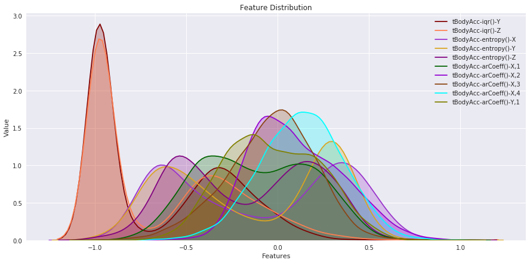
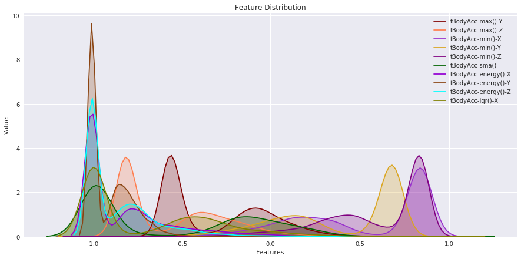
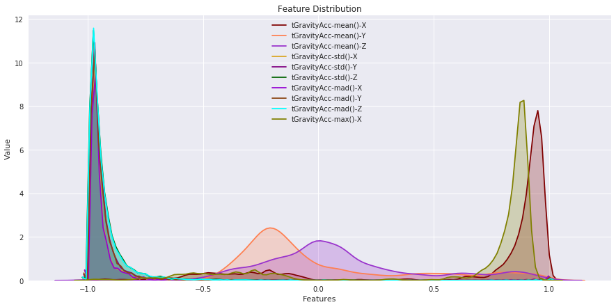
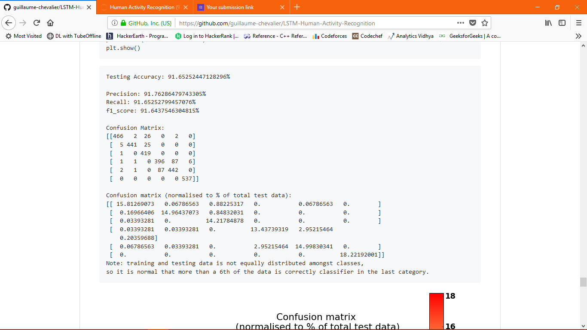
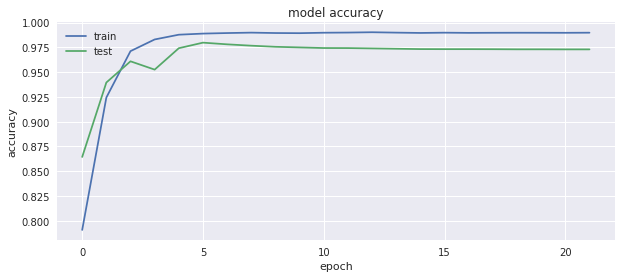
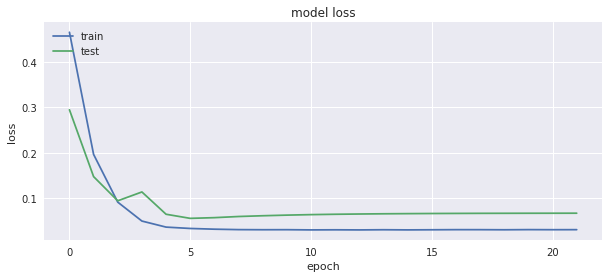

# Human-Activity-Recognition-with-Neural-Network-using-Gyroscopic-and-Accelerometer-variables

## Video dataset overview

**Follow this link to see a video of the 6 activities recorded in the experiment with one of the participants:**

  
  <a href="https://youtu.be/XOEN9W05_4A">
[Watch video]
</a>

## Details:

**Artificial Neural Network with a validation accuracy of 97.98 % and a precision of 95% was achieved from the data to learn (as a cellphone attached on the waist) to recognise the type of activity that the user is doing. My work is inspired from guillaume-chevalier/LSTM-Human-Activity-Recognition but he used RNN-LSTM to recognize the activity whereas I used ANN for the same. And had achieved a better confusion matrix as well as the validation accuracy than the RNN-LSTM. Bidirectional LSTM on the other hand gave around 94 % but which is still less. The above VALIDATION ACCURACY is also best on KAGGLE.
The approach might be little different.**

**The dataset's description goes like this:**

**The sensor signals (accelerometer and gyroscope) were pre-processed by applying noise filters and then sampled in fixed-width sliding windows of 2.56 sec and 50% overlap (128 readings/window). The sensor acceleration signal, which has gravitational and body motion components, was separated using a Butterworth low-pass filter into body acceleration and gravity. The gravitational force is assumed to have only low frequency components, therefore a filter with 0.3 Hz cutoff frequency was used.** 

**That said, I will use the almost raw data: only the gravity effect has been filtered out of the accelerometer  as a preprocessing step for another 3D feature as an input to help learning.** 

 

 

## Attribute Information:

**For each record in the dataset it is provided:**
- Triaxial acceleration from the accelerometer (total acceleration) and the estimated body acceleration.
- Triaxial Angular velocity from the gyroscope.
- A 561-feature vector with time and frequency domain variables.
- Its activity label.
- An identifier of the subject who carried out the experiment.

## References

The [dataset](https://archive.ics.uci.edu/ml/datasets/Human+Activity+Recognition+Using+Smartphones) can be found on the UCI Machine Learning Repository. 
